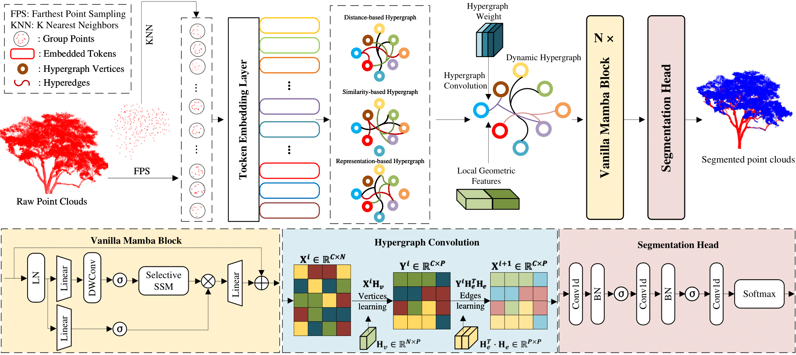

# Dynamic Hypergraph-guided Mamba for TLS Point Cloud Foliage Separation (GIScience & Remote Sensing-2025)
---

## Abstract
Effective foliage-wood separation plays a crucial role in forestry applications such as Leaf Area Index (LAI) estimation and Quantitative Structure Models (QSM). Point clouds provide valuable support for this task. However, large-scale scenes, uneven density, and occlusions hinder the use of general 3D vision methods. Existing Transformer-based methods typically partition point clouds into local patches, but the high computational complexity restricts the feasible patch size, often fragmenting tree structures and causing semantic information loss. Moreover, the geometric similarity of fine-scale foliage, coupled with limited context in small patches, makes feature discrimination more difficult. These two issues severely limit the performance of existing methods on foliage segmentation tasks. To address these challenges, we propose the Dynamic Hypergraph-guided Mamba (DHMamba) model with two key innovations. First, we leverage a lightweight Mamba-based architecture whose linear complexity enables processing of larger patches, thereby expanding the receptive field and reducing erroneous segmentation of branches and leaves. Second, we introduce a dynamic hypergraph-based serialization strategy to capture higher-order topological dependencies within local regions, enhancing the model’s ability to extract discriminative features. Moreover, by introducing prior global density and designing two geometric feature descriptors—planarity and linearity, our framework further enhances the multi-scale discrimination of subtle differences in canopy. Extensive experiments on individual-tree and plot-scale datasets demonstrate that DHMamba substantially advances segmentation accuracy and robustness, highlighting its strong potential for practical large-scale forest point-cloud analysis and sustainable forest-resource management.


## Overview



---

## Experimental Results

- Experimental results on three single-tree-scale datasets

| Method (metric: mIoU)    | Tropical           |                   | Mixed Forest      |                   | ForestSemantic    |                   |
|--------------------------|--------------------|-------------------|-------------------|-------------------|-------------------|-------------------|
|                          | Mean               | (±std, p)         | Mean              | (±std, p)         | Mean              | (±std, p)         |
| LeWoS                    | 0.7181             | ±5.49, 1.54e-3    | 0.7247            | ±2.78, 3.67e-4    | 0.6200            | ±2.21, 1.27e-3    |
| PointNeXt                | 0.8176             | ±3.01, 8.87e-5    | 0.7837            | ±1.76, 3.39e-3    | 0.6753            | ±1.75, 1.45e-4    |
| PointNet++               | 0.7847             | ±3.81, 6.62e-4    | 0.7655            | ±1.70, 2.48e-3    | 0.6631            | ±1.94, 4.02e-3    |
| PointTransformer         | 0.8181             | ±1.67, 2.19e-4    | 0.7778            | ±1.60, 2.75e-3    | 0.6825            | ±1.42, 1.50e-4    |
| PointTransformerV2       | 0.8401             | ±2.63, 1.86e-3    | 0.8162            | ±1.38, 2.93e-3    | 0.7040            | ±1.73, 9.19e-3    |
| PointCloudMamba          | 0.8378             | ±1.65, 2.09e-3    | 0.8092            | ±1.29, 1.44e-3    | 0.7088            | ±1.71, 2.98e-3    |
| Mamba3D                  | 0.8455             | ±2.14, 5.01e-3    | 0.8139            | ±1.46, 1.13e-3    | 0.7107            | ±1.66, 5.50e-3    |
| Sen-Net                  | 0.8236             | ±2.48, 1.39e-5    | 0.7812            | ±1.76, 1.19e-2    | 0.6743            | ±1.99, 2.20e-3    |
| DHMamba w/o MSHG         | 0.8483             | ±2.04, 1.84e-3    | 0.8147            | ±1.45, 1.54e-3    | 0.7301            | ±1.87, .50e-3     |
| **DHMamba (Ours)**       | **0.8643**†        | ±2.42, -          | **0.8343**†       | ±1.63, -          | **0.7445**†       | ±2.33, -          |


- Experimental results on four plot-scale datasets

| Method               | Birch           |                | Larch           |                | ForestSemantic   |                | Evo MLS         |                |
|----------------------|-----------------|----------------|-----------------|----------------|------------------|----------------|-----------------|----------------|
|                      | Mean            | (±std, p)      | Mean            | (±std, p)      | Mean             | (±std, p)      | Mean            | (±std, p)      |
| LeWoS                | 0.4746          | ±2.56, 4.07e-3 | 0.5246          | ±2.56, 1.01e-2 | 0.4366           | ±6.83, 4.92e-4 | 0.5746          | ±2.56, 1.39e-2 |
| PointNeXt            | 0.4529          | ±2.61, 4.45e-4 | 0.4970          | ±3.09, 7.73e-3 | 0.5643           | ±3.63, 3.16e-3 | 0.5463          | ±3.18, 4.76e-3 |
| PointNet++           | 0.4583          | ±3.31, 4.83e-3 | 0.5083          | ±3.31, 7.64e-3 | 0.5573           | ±4.53, 4.27e-3 | 0.5583          | ±3.31, 4.82e-3 |
| PCT                  | 0.4791          | ±1.53, 3.67e-3 | 0.5291          | ±1.53, 9.80e-3 | 0.5901           | ±2.90, 4.75e-4 | 0.5791          | ±1.53, 1.02e-3 |
| PCTV2                | 0.5027          | ±2.19, 6.82e-3 | 0.5492          | ±1.18, 1.69e-2 | 0.6203           | ±1.46, 1.54e-4 | 0.6027          | ±1.13, 3.73e-3 |
| PointCloudMamba      | 0.5016          | ±1.21, 2.67e-2 | 0.5456          | ±1.14, 5.48e-3 | 0.6198           | ±1.10, 4.37e-3 | 0.6038          | ±1.72, 1.56e-2 |
| Mamba3D              | 0.5139          | ±2.89, 3.02e-2 | 0.5430          | ±1.00, 9.90e-3 | 0.6161           | ±1.12, 2.36e-3 | 0.5939          | ±1.18, 1.69e-3 |
| Sen-Net              | 0.4908          | ±1.85, 2.11e-3 | 0.4908          | ±1.85, 2.22e-3 | 0.5702           | ±1.50, 6.46e-4 | 0.5482          | ±1.79, 8.39e-4 |
| DHMamba w/o MSHG     | 0.5146          | ±2.30, 4.78e-3 | 0.5789          | ±2.08, 5.62e-3 | 0.6587           | ±1.82, 3.73e-3 | 0.6243          | ±1.25, 2.03e-2 |
| **DHMamba (Ours)**   | **0.5313**†     | ±2.82, -       | **0.5858**†     | ±2.17, -       | **0.6688**†      | ±1.77, -       | **0.6312**†     | ±1.33, -       |

---

## Usage
### Dataset preparation

All the datasets used in this study are publicly accessible:

Tropical dataset is available at: [Download Link](https://datadryad.org/dataset/doi:10.5061/dryad.np5hqbzp6)

ForestSemantic dataset is available at: [Download Link](https://zenodo.org/records/15193973)

Birch, Larch, and CST dataset is available at: [Download Link](https://datadryad.org/dataset/doi:10.5061/dryad.rfj6q5799)

Evo dataset is available at: [Download Link](https://etsin.fairdata.fi/dataset/81e2f3ad-ed88-4dd5-9f59-401d30fac7de)

### Data preprocessing

```python
# To calculate global density:
python data_utils/avg_dist_calculate.py

# To preprocess the data:
python data_utils/main.py
```

### Environment
This code was tested on Ubuntu 20.04, PyTorch 1.13.1 + cu117 and Python 3.9. It may work with other versions.

### Installation

```bash
# Clone the repository
git clone https://github.com/ZhangIceNight/foliage_segmentation.git
cd foliage_segmentation

# Create a virtual conda environment
conda create -n DHMamba -y python=3.10
conda activate
pip install torch==1.13.1+cu117 torchvision==0.14.1+cu117 torchaudio==0.13.1 --extra-index-url https://download.pytorch.org/whl/cu117

# Install dependencies
pip install -r requirements.txt

# (Optional) Install PointNet++.
pip install "git+https://github.com/erikwijmans/Pointnet2_PyTorch.git#egg=pointnet2_ops&subdirectory=pointnet2_ops_lib"

# Install mamba
pip install causal-conv1d==1.1.1
pip install mamba-ssm==1.1.1
```
### Train

```bash
bash scripts/train.sh --config-name Larch_dhmamba_lr2e-4_bs16 --fold 5
```

### Evaluation

```bash
bash scripts/evaluate.sh --config-name Larch_dhmamba_lr2e-4_bs16 --fold 5
```
